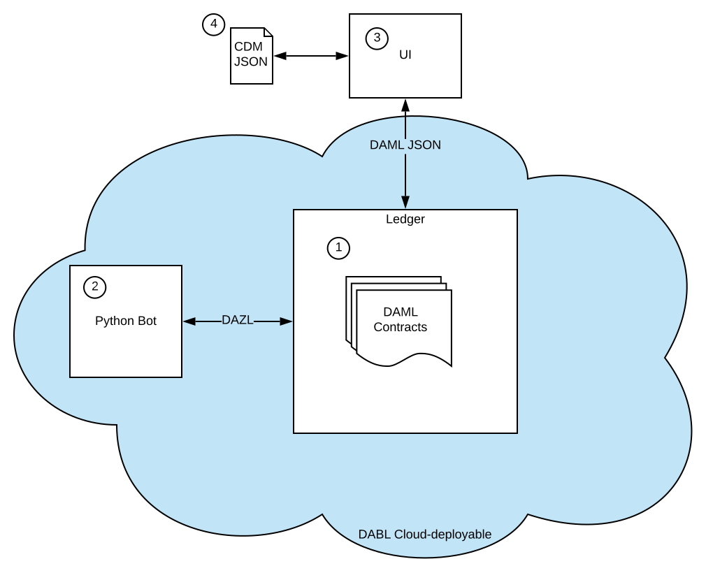

# Barclays 2019 DerivHack DAML Guide

This guide will help you

  1. Set up a local dev environment
  2. Architect your application so you can stage everything locally, and then promote to prod on our "DABL" cloud in a single step.

The DAML ecosystem provides a lot of flexibility for developers: there exist multiple APIs and language bindings. However, only a subset of these are currently supported on the DABL cloud, so it's important that you stick to the architecture presented here for the purposes of this Hackathon.

## Architecture Overview

The diagram below shows the architecture we will use. The blue cloud represents the components that can be run on the DABL cloud.

1. Your DAML model will sit on a ledger (aka block-chain) either hosted in the [DABL cloud](https://projectdabl.com), or run as a local [sandbox ledger](https://docs.daml.com/tools/sandbox.html) process. The ledger will guarantee the integrity e.g. authentication, atomicity etc. of business transactions in your DAML models.
2. As DAML models need to ultimately execute in a distributed environment, they are deterministic by design, and as a result there are some things they can't do. One of these is concurrency. To get around this, it is common to run off-ledger processes who's sole job is to listen for transactions on the ledger and trigger events/choices as a result. We refer to these as _bots_ or _triggers_ (by analogy to SQL triggers).
For bots to run on the cloud, they **must** use the [DAZL API](https://github.com/lucianojoublanc-da/dazl-client), rather than e.g. the Java or Scala clients, and they may _not_ do any I/O.
3. Going a step further, we may want to perform I/O with external users or systems. For security, such process must be run outside the cloud environment and interact via a simple [REST API](https://docs.projectdabl.com/#apicontracts_get), using the language and library of your choice; this can even be JavaScript embedded on your own website.

## Local Dev

The local stack will consists of:
1. Microsoft Visual Studio Code IDE (Recommended) for DAML, Python editing. You will need the following extensions:
    - DAML
    - Microsoft Python
2. [DAML SDK](https://docs.daml.com/getting-started/installation.html#install-the-sdk) for
    - Creating a skeleton project `daml new`. Modify `daml.yaml` and `daml/Main.daml` as necessary. Start the IDE with `daml studio`.
    - Compiling DAML files to `*.dar` archives from IDE, or alternatively `daml build`, which generates them under `.daml/dist/`.
    - Running the local ledger with `daml sandbox`. Alternatively, scenarios can be tested from the IDE ("view scenario results" hyperlink above code).
3. APIs
    - [DAZL](https://github.com/lucianojoublanc-da/dazl-client)  ([api docs](https://lucianojoublanc-da.github.io/dazl-client)), a simplified python-based API requiring no code-gen step. Note that, as of writing, this doesn't integrate with Jupyter notebooks. Note that at this moment this is the only API that can be hosted on the DABL cloud (see point 2 in previous section). The [official bindings](https://docs.daml.com/app-dev/app-arch.html#application-libraries) are not supported at this time.
  Please also note that this is not properly documented right now; this should be fixed over the coming weeks.
    - [REST](https://docs.projectdabl.com/#apicontracts_get) This is WIP. Currently the local equivalent of this is not available, and/or fully documented. Be aware that an updated version of the API is in the works, which is yet to be integrated into DABL. More info forthcoming.

## Hosted Dev

If you have followed the previous steps, you should be able to painlessly deploy your app into the DABL cloud:

1. Go to [https://projectdabl.com](https://projectdabl.com) and sign-up for an account.
2. Create a new project (DerivHack2019) and ledger (staging).
3. You should be prompted to upload your `*.dar` archives. Do so by drag-and-dropping required files.
4. Under the `Active Contracts` tab, press the `+ Add Party` button and `+ New from template` to create users and contracts, respectively, on the ledger.
5. You can exercise choices that appear as buttons at the top of each selected contract. Note these will always have a `Party` field at the top - this is the submitting party.

Please bear in mind that, until further notice, we do not provide an SLA for the hosted environment, and it may be wiped at any time. It is currently managed out of NY. Having said this, I understand they have nearly met their goals of 99% uptime last quarter.
